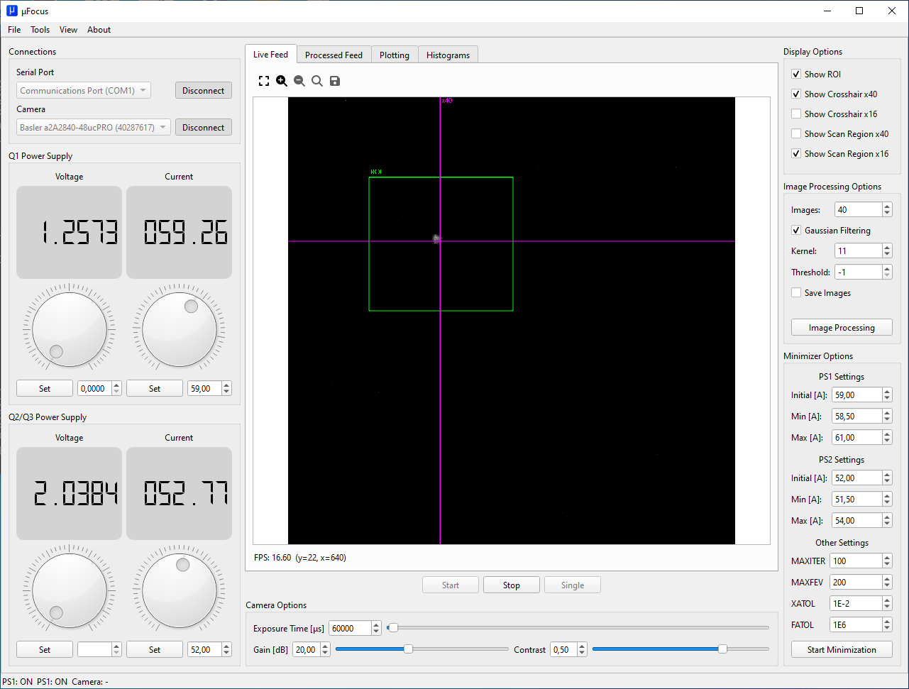
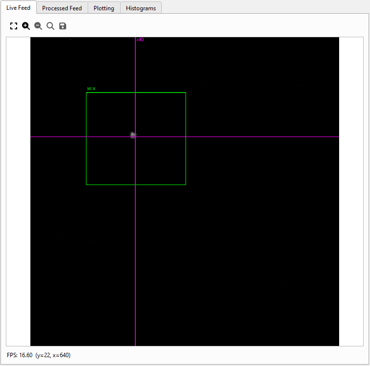
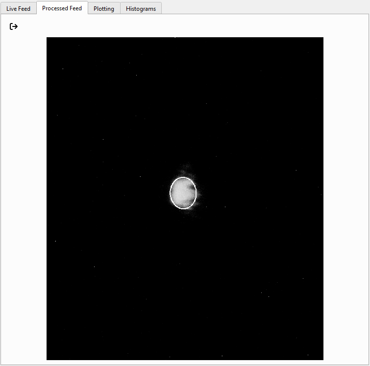
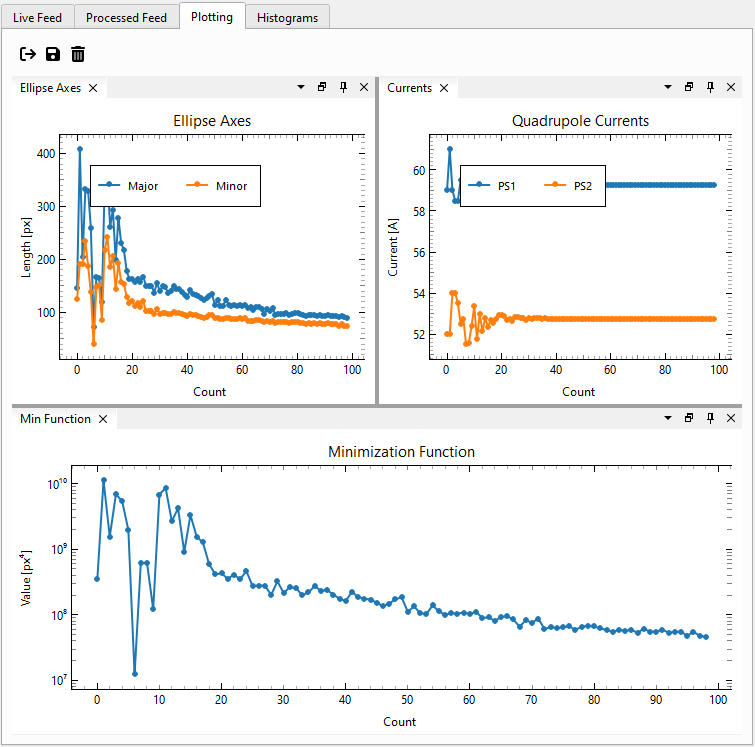
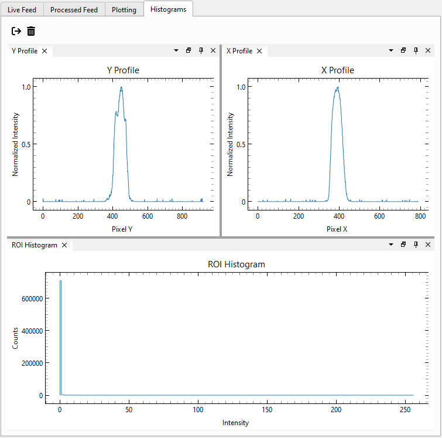
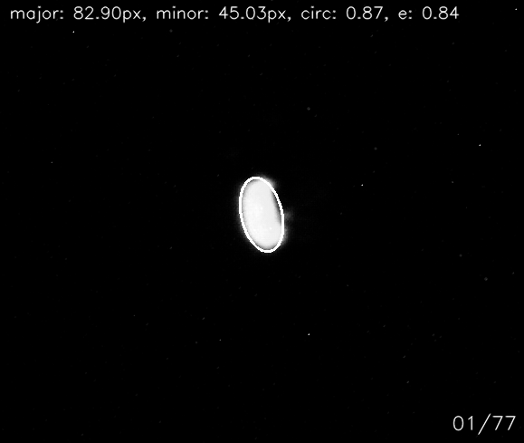

<h1 align="center">
  
  <br>
  μFocus [<em>microFocus</em>]
</h1>

<p align="center"><strong>An autofocusing system for the nuclear microprobe at the Tandem Laboratory, Uppsala University</strong></p>

# What is μFocus?
μFocus is an autofocusing system written in Python and designed specifically for the nuclear microprobe at the Tandem Laboratory, Uppsala University. _However, it is possible to be adapted in order to work for other microprobes as well._



μFocus integrates a camera and two power supplies to accomplish the task of automatically focusing an ion beam with minimal operator intervention. In short, the system uses the camera to obtain real-time images of the beam spot impinging on a fluorescent screen. The images from the camera are processed, and the spot dimensions are extracted. These dimensions are treated as input data in the optimization system. μFocus utilizes the power supplies to adjust the magnetic field excitation currents of the quadrupole lenses of the microprobe according to the Nelder-Mead optimization algorithm and an objective function. New data are obtained in an iterative way, until a minimum beam spot is found according to certain criteria specified by the user of the application.

<p align="center">






</p>

Features:
* Control basic functionality of the power supplies and the camera using a single application
* Live camera feed for real-time inspection of the beam spot
* Region of interest (ROI) selection of the beam spot for more efficient image processing
* Set/unset crosshairs and scan regions using the mouse to keep track of the beam (no more markers on the computer screens!)
* Show/hide ROI, crosshairs and scan region objects
* Control image processing options and parameters
* Inspect the processed images using the processed image feed
* Minimization of the beam spot dimensions using image processing ([OpenCV](https://opencv.org)) and the Nelder-Mead algorithm ([SciPy](https://scipy.org))
* Real-time analytical outputs (plots and histograms)
* Saving of processed images and data
* Logging functionality

> [!NOTE]
> Obviously, not all cameras or power supply models are supported. Cameras supported by the Basler pylon Camera Software Suite via [pypylon](https://github.com/basler/pypylon) should, at least theoretically, work without problems. Concerning the supported power supply models, μFocus has only been used with the TDK-Lambda GEN6-100. However, all TDK-Lambda Genesys programmable power supplies supporting the SR-232 interface should work with very few code changes, if any.

> [!IMPORTANT]
> This software is not endorsed of affiliated by any means with Basler AG or TDK-Lambda.

# Example run

The example demonstrated below is from a 2 MeV H<sup>+</sup> beam incident on a fluorescent screen. Between each objective function evaluation, indicated by the number at the lower left of the illustration below, μFocus first accumulates a number of consecutive frames (as many as the user selects), and the average image is obtained. This pre-processing step is necessary in order to counterbalance beam instabilities and other sources of noise. After feature detection, the major and minor axes of the beam-spot are used as input in the minimization algorithm in play behind the scenes. Updated currents for the power supplies are the output of the minimizer in each step. After a number of iterations, and according to termination criteria selected by the user, μfocus is able to find the combination of power supply currents yielding the minimum beam-spot dimensions.



# Run μFocus

Download and extract the latest `.zip` file under the Releases section. Run the `μFocus.exe` file in the extracted folder. μFocus is distributed as a compiled binary distribution package (with the help of [Nuitka](https://github.com/Nuitka/Nuitka)). Only Windows binaries are currently supported in this format. See below for instructions on how to produce binaries for other operating systems.

Alternatively, independently of the operating system, μFocus can be run as a regular Python script. Download and install Python, e.g. with [Miniforge](https://github.com/conda-forge/miniforge). The application has been tested with Python 3.10 and 3.11, however Python 3.11 is recommended.

Once Python is installed, create an environment named e.g. ufocus:
```
conda create -n ufocus
```

Activate the environment and install the required packages:
```
conda activate ufocus
pip install -r requirements.txt
```

Once the dependencies of μFocus have been installed, download the code in this repository and run the application:
```
python ufocus/main.py
```

# Build using Nuitka
To build a binary distribution from source, install [Nuitka](https://github.com/Nuitka/Nuitka) with pip in the environment where the dependencies of μFocus are also installed:
```
pip install nuitka
```

Run the following command to produce a binary distribution:
```
nuitka ufocus/main.py --standalone --remove-output --enable-plugin=pyside6 --user-package-configuration-file=pypylon.yml --output-dir=deployment --noinclude-qt-translations --windows-icon-from-ico=icons/icon3_256.png
```
This will create a folder named ```main.dist``` in the deployment folder. The application can be executed with the ```main.exe``` inside that folder. For other options, check the [documentation](https://nuitka.net/) of Nuitka.

### Build application icons using the QResource system
```
pyside6-rcc resources.qrc -o ufocus\resources.py
```
